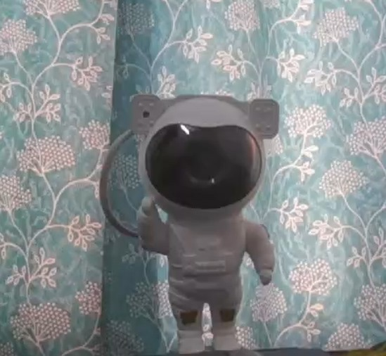

# Invisibility Cloak

## Overview
The Invisibility Cloak project is an application that replaces an image with the background using bitwise operations on images. It utilizes  image processing techniques, including bitwise operations and masking, to create the illusion of invisibility. 

## How to Run
1. Clone or download the repository to your local machine.
2. Run the Flask application using the following command:
   ```
    python app.py  
    ```
   ```
  or py app.py
   ```
3. Open your web browser and go to `http://localhost:5500` to access the application.

## Features
- Replace an image with the background using bitwise operations and masking.
- Utilizes advanced image processing techniques to create the illusion of invisibility.
- Built with OpenCV for image processing and Flask for the backend.
- Frontend implemented with HTML, CSS, and JavaScript.

## Preview
The robot is being cloaked by a red colored cloak which is being being replaced by the existing backround



